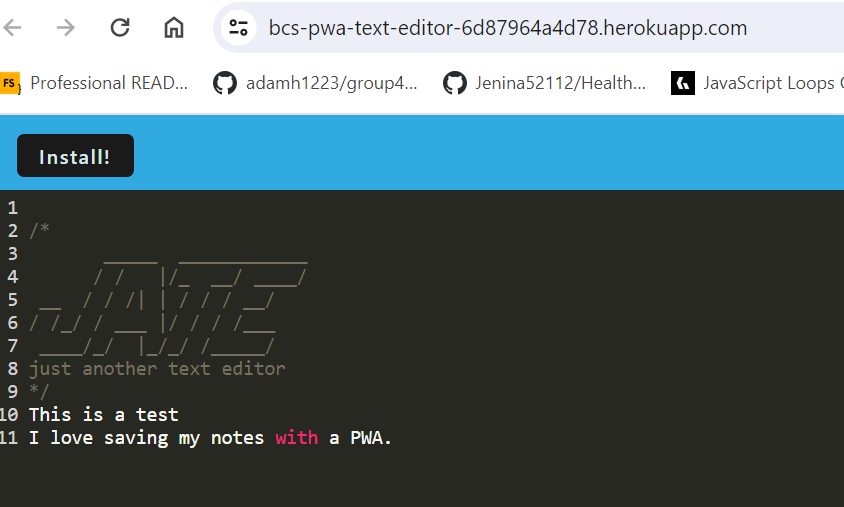

# PWA_Text_Editor

## Description

To create a text editor as a PWA application. Data is stored to an IndexDB database and the use of IDB as a wrapper performs the methods to view and update the database for the text editor. The application can run online or offline. Workbox is used for static assets and pages. Data can be retrieved from the database or local storage. Furthermore, an offline application can be installed to the users desktop.

## Installation

N/A

## Usage

The VS Code editor displays a client server folder structure.

npm run start from the application root directory starts the server and serves the app.

The javascript files have been bundled with a HTML file, service worker, and a manifestfile from the webpack plugins.

The next-gen javascript functions in the browser.

The app stores data with IndexDB and clicking of the DOM window the data is stored in IndexDB.

Clicking on the install button the application is downloaded as an icon on my desktop.

A registered service worker using workbox upon load and static assets pre-cached upon loading along with subsequent pages and static assets.

Lastly, Heroku is fully deployed.

GitHub Repository: https://github.com/rethomas67/PWA_Text_Editor

Live Server: https://bcs-pwa-text-editor-6d87964a4d78.herokuapp.com/

## Credits

N/A

## License

Project is licensed under the ISC license.

N/A
